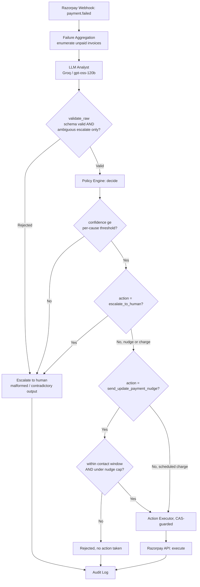

# Revenue Recovery Agent

Detects halted subscriptions, classifies why the payment failed using a live LLM, and recovers what's recoverable — without letting the model touch money directly.

**Built for the Razorpay AI Buildathon 2026 — Revenue Recovery track.**

## Table of Contents

- [Problem](#problem)
- [How it works](#how-it-works)
- [Architecture](#architecture)
- [Why the policy engine sits between the model and the money](#why-the-policy-engine-sits-between-the-model-and-the-money)
- [Results](#results)
- [Limitations](#limitations)
- [Incident: exposed API key](#incident-exposed-api-key)
- [Built with](#built-with)
- [Setup](#setup)
- [Usage](#usage)
- [Build process / roadmap](#build-process--roadmap)
- [License](#license)
- [Contact](#contact)

## Problem

Recurring payments fail silently. The subscription halts, and the typical response is either a blind retry that burns money on dead cards, or blanket escalation that wastes human time on cases that don't need a human. The revenue lost here is recoverable — it just requires correctly identifying why the payment failed before deciding what to do about it.

## How it works

Halted subscription → LLM classifies the failure reason → a deterministic policy engine checks the classification against confidence thresholds and hard safety rules → only a policy-approved action reaches the Razorpay API → every decision is logged.

The model proposes. The policy engine decides what's allowed to happen.

## Architecture

```text
Webhook
  ↓
Failure Aggregation
  ↓
LLM Analyst (Groq / gpt-oss-120b)
  ↓
Policy Engine — the only component allowed to touch money
  ↓
Action Executor (CAS-guarded)
  ↓
Audit Log
```



## Why the policy engine sits between the model and the money

A confidence score is a signal, not a guarantee. The model's `recommended_action` never executes directly — it passes through a deterministic gate first.

Two layers enforce this:

**`BaseAnalyst.validate_raw()`** (`src/analyst.py`) — if the model classifies a case as `ambiguous_or_low_confidence`, the only valid recommendation is `escalate_to_human`. Any other pairing is rejected before it reaches the policy engine at all.

**`PolicyEngine.decide()`** (`src/policy_engine.py`) — checks the recommendation against per-cause confidence thresholds in `policy.yaml`, enforces the allowed contact window (`_now_in_allowed_window()`), caps nudges per subscription, and escalates anything malformed or below threshold.

## Results

Measured output from `eval/results/run_eval.txt`, 16-case batch. The stratified columns are always
grouped by each fixture's frozen `archetype`, not by the live model's classification, so model
mistakes remain in the ground-truth bucket they belong to.

| Metric | Dead-card | Insufficient-funds | Ambiguous | Overall |
|---|---|---|---|---|
| n | 6 | 6 | 4 | 16 |
| Recovery rate (95% CI) | 1.000 (0.610, 1.000) | 0.833 (0.436, 0.970) | 0.000 (0.000, 0.490) | 0.688 (0.444, 0.858) |
| Decision latency (median / p95, ms) | 200 / 200 | 300 / 440 | 440 / 440 | 300 / 440 |
| Unsafe-action rate | 0.000 | 0.167 | 0.000 | 0.062 |
| Unnecessary-action rate | 0.000 | 0.167 | 0.000 | 0.062 |
| Duplicate-action rate | 0.000 | 0.000 | 0.000 | 0.000 |
| Correct-escalation rate | 0.000 | 0.000 | 1.000 | 0.250 |
| INR recovered | 4810 | 5890 | 0 | 10700 |
| Action cost (INR) | 150 | 240 | 160 | 550 |
| Net recovered value | 4660 | 5650 | -160 | 10150 |
| Lift vs. blind-retry-once baseline | 0.000 | -0.167 | 0.000 | -0.062 |

Unresolved: `eval_13` — expected escalation, got `send_update_payment_nudge`.

Before the `validate_raw()` coupling fix, overall unsafe-action rate was 0.250 (0.667–0.750 on the ambiguous stratum — every ambiguous case was recommending a live money action). After the fix: 0.062 overall, 0.000 on ambiguous. The bug was the model recommending an action on a case it had itself flagged as too uncertain to act on; the fix rejects that pairing at the source.

## Limitations

- **`eval_13`** — model classifies with 0.92 confidence as `insufficient_funds_pattern`; ground truth expects escalation. Calibration issue on the model's side, not a policy or code defect — the policy engine still gates the resulting action correctly against the confidence threshold.
- **Reproducibility** — given a fixed list of classification outputs, the scoring and metrics
  computation is deterministic and byte-identical. The live Groq classifier is not held to that
  standard: MoE-served models do not guarantee bit-exact output even at `temperature=0.0`, so the
  reported table is the canonical output of one explicitly recorded live run.

## Incident: exposed API key

A test API key was committed to this public repo during local debugging. Response:

1. Confirmed repo was public
2. Rotated the key at the provider
3. Verified the new key end-to-end
4. Re-ran the full regression suite
5. Rewrote git history with `git-filter-repo` to remove the file from all commits, not just HEAD
6. Force-pushed, verified with `git log --all --full-history -- key_test.txt` returning no output

`.gitignore` now excludes `.env` and debug-output file patterns by default.

## Built with

- Python 3.11
- FastAPI
- SQLite
- Groq API (`openai/gpt-oss-120b`)
- Razorpay API (test mode)
- pytest

## Setup

```bash
python -m venv .venv
. .venv/bin/activate  # .\.venv\Scripts\Activate.ps1 on Windows
pip install -r requirements.txt
```

Copy `.env.example` to `.env`, add `GROQ_API_KEY`.

## Usage

```bash
pytest -q
python scripts/run_eval.py
```

`run_eval.py` runs the frozen 16-case evaluation batch through the full pipeline — classifier, policy engine, executor — and writes the results table shown above to `eval/results/run_eval.txt`.
The live model call can vary between runs; the scoring functions are deterministic once those
classification outputs are fixed.

## Build process / roadmap

Six phases, each built and tested before the next started:

- [x] Schema and dual-state design
- [x] Webhook ingestion — signature verification, dedup
- [x] Failure aggregation and unpaid-invoice enumeration
- [x] LLM classifier + deterministic policy engine
- [x] Policy-gated action executor — CAS-guarded concurrency, audit logging
- [x] Evaluation harness — live LLM replacing the rule-based placeholder
- [ ] Calibration analysis on model confidence scores against ground truth, to tune `policy.yaml` thresholds from real error distribution instead of heuristic defaults
- [ ] Real Razorpay webhook integration in production traffic, same signature-verification and dedup rules as the current test harness
- [ ] Human-review UI for escalated cases — shows evidence and policy reasoning without exposing the raw LLM prompt

## License

No license file is currently included in this repository.

## Contact

Srishti Pandey — pandey.srishti1203@gmail.com
Repo: [github.com/srishtipandey1/reclaim](https://github.com/srishtipandey1/reclaim)
