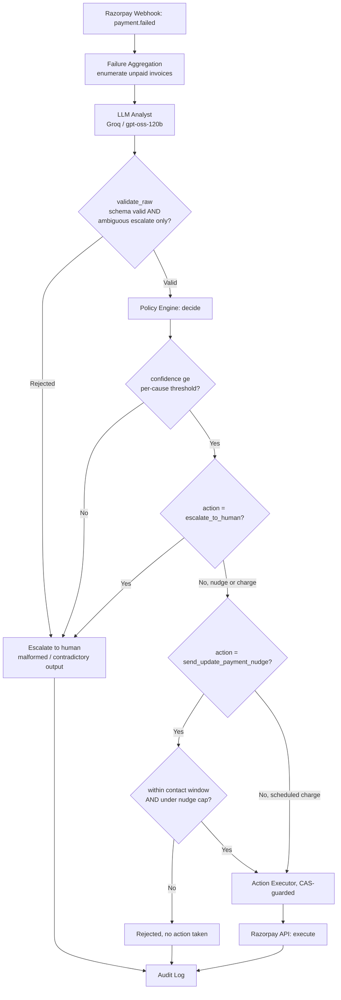

# Reclaim

## Revenue recovery after Razorpay gives up

Razorpay already retries failed subscription charges automatically. After four failed attempts,
the subscription reaches `halted` and automatic charging on the saved card stops, even while future
billing cycles can continue generating invoices.

**Reclaim starts exactly where Razorpay's own subscription automation stops.**

It turns a halted subscription into a bounded, auditable recovery case:

```text
verified webhook -> failure history -> unpaid invoices -> analyst -> policy gate -> executor -> outcome
```

The model can explain a case and recommend an action. It cannot execute money. A deterministic
policy engine is the authority between the model and any recovery action.

> This repository is a focused test-mode prototype for the Razorpay AI Buildathon Revenue Recovery
> track. Its measured evaluation is fixture-based, and its live provider path is intentionally
> separated from the local scoring harness. See [Limitations](#limitations) before treating any
> number as a production claim.

## Contents

- [Problem](#problem)
- [What Reclaim does](#what-reclaim-does)
- [Architecture](#architecture)
- [Trust boundaries](#trust-boundaries)
- [State model](#state-model)
- [Policy](#policy)
- [Evaluation](#evaluation)
- [Repository map](#repository-map)
- [Run locally](#run-locally)
- [Demo flow](#demo-flow)
- [Limitations and honest boundaries](#limitations-and-honest-boundaries)
- [Roadmap](#roadmap)
- [Security](#security)
- [License](#license)

## Problem

A halted subscription is not necessarily a lost customer. It may represent an expired card, a
payment method that was replaced but not updated, a temporary low-balance event, or a case whose
signals genuinely conflict. A blind retry treats all of these the same. Blanket escalation treats
all of them as someone else's problem.

The useful decision is narrower:

1. What evidence explains this failed payment?
2. Which unpaid invoice is being considered?
3. Is the recommendation confident and consistent with policy?
4. Is the action allowed at this time and within the stopping rules?
5. Can an operator later see what was proposed, approved, executed, and observed?

Reclaim is built around those questions rather than around an unconstrained autonomous agent.

## What Reclaim does

For a halted subscription, the system is designed to:

- verify the raw Razorpay webhook body with HMAC-SHA256;
- deduplicate events using the Razorpay event ID and a database uniqueness constraint;
- preserve webhook order by comparing event timestamps;
- enumerate every currently unpaid invoice, not only the newest one;
- build a bounded recovery context from payment and failure history;
- ask an Analyst for a schema-validated classification, confidence, evidence, and recommendation;
- reject malformed output instead of repairing or interpreting it;
- require the deterministic Policy Engine to approve any action;
- enforce IST contact hours and action caps;
- re-read case state immediately before execution with a compare-and-swap guard;
- write decision records before and after an action; and
- leave unresolved or disallowed cases available for human escalation.

The current FastAPI service exposes webhook ingestion and health/OpenAPI endpoints. The evaluation
harness exercises the Analyst and Policy Engine against frozen local fixtures. The separation is
intentional and documented; it avoids presenting a fixture scorer as a live payment system.

## Architecture

High level: Webhook -> Aggregation -> LLM Analyst -> Policy Engine -> Executor -> Audit Log

```text
Webhook
  |
  v
Failure Aggregation
  |
  v
LLM Analyst (Groq / gpt-oss-120b)
  |
  v
Policy Engine - the only component allowed to approve money actions
  |
  v
Action Executor (CAS-guarded)
  |
  v
Audit Log
```



The architecture has two important paths after the policy decision:

- `escalate_to_human` ends in an audit record without a money action.
- A policy-approved nudge or scheduled charge enters the executor, which performs its final state
  check before dispatch.

## Trust boundaries

| Component | Responsibility | Authority |
|---|---|---|
| Razorpay webhook receiver | Authenticate and persist provider events | May write provider observations after signature verification |
| LLM Analyst | Classify failure, provide evidence, recommend one action | No execution authority |
| `validate_raw()` | Enforce the output schema and ambiguous/action coupling | Rejects malformed or contradictory output |
| Policy Engine | Apply thresholds, contact hours, and caps | Only component that approves a recovery action |
| Action Executor | Perform the approved operation after a final state read | CAS-guarded; stale or duplicate attempts abort |
| SQLite audit tables | Preserve decisions, actions, and outcomes | Append-oriented record of what happened |

The safety rule is simple: model output is a proposal, policy output is a gate, and the executor is
the only dispatch boundary. No confidence score can bypass the policy engine.

## State model

Reclaim deliberately keeps two independent state fields:

### Razorpay state

`created`, `authenticated`, `active`, `pending`, `halted`, `cancelled`, `paused`, `expired`, and
`completed` describe Razorpay's subscription lifecycle. The value is derived from verified provider
events and should not be confused with the agent's internal case progress.

### Case state

`none -> analyzing -> policy_checked -> action_pending -> verified -> resolved`, with
`escalated` as a terminal human-review route. A subscription can be active in Razorpay while its
recovery case is being analyzed, or halted in Razorpay while the case is already escalated.

More detail is in [docs/state_machine.md](docs/state_machine.md).

## Policy

The policy is configuration, not model memory. The checked-in [policy.yaml](policy.yaml) defines:

- allowed customer-contact hours of 08:00-19:00 local policy time;
- a maximum of two payment nudges per subscription;
- per-cause confidence thresholds;
- one bounded attempt for each configured recovery action; and
- escalation fallbacks for unsupported or low-confidence cases.

The Policy Engine also converts aware timestamps to IST before checking the contact window. SQLite
triggers enforce the hard maximum of three actions per invoice and the nudge cap independently of
application-level checks.

## Evaluation

The frozen evaluation set contains 16 fixture cases. The columns below are grouped by each case's
frozen fixture archetype, not by the Analyst's predicted classification. This keeps classification
mistakes in the stratum they actually belong to.

The following is the canonical output of one live Groq run. Live model output is not claimed to be
bit-identical across runs; the scoring/rendering stage is deterministic when given a fixed list of
classification results.

| Metric | Dead-card | Insufficient-funds | Ambiguous | Overall |
|---|---:|---:|---:|---:|
| n | 6 | 5 | 5 | 16 |
| Recovery rate (95% CI) | 1.000 (0.610, 1.000) | 1.000 (0.566, 1.000) | 0.000 (0.000, 0.434) | 0.688 (0.444, 0.858) |
| Decision latency (median / p95, ms) | 200 / 200 | 300 / 300 | 440 / 440 | 300 / 440 |
| Unsafe-action rate | 0.000 | 0.000 | 0.400 | 0.125 |
| Unnecessary-action rate | 0.000 | 0.000 | 0.400 | 0.125 |
| Duplicate-action rate | 0.000 | 0.000 | 0.000 | 0.000 |
| Correct-escalation rate | 0.000 | 0.000 | 0.600 | 0.188 |
| INR recovered | 4810 | 5890 | 0 | 10700 |
| Action cost (INR) | 150 | 200 | 200 | 550 |
| Net recovered value | 4660 | 5690 | -200 | 10150 |
| Lift vs. blind-retry-once baseline | 0.000 | 0.000 | 0.000 | 0.000 |

Unresolved cases in the canonical run:

- `eval_13`: expected escalation, got a payment nudge.
- `eval_15`: expected escalation, got a payment nudge.

This is not a zero-risk result. The ambiguous stratum has a 0.400 unsafe-action rate in this run,
and that limitation is kept visible rather than hidden in an overall average.

### Reproducibility claims

These are two different claims:

- **Scoring determinism:** a fixed list of classification-derived records produces byte-identical
  metrics output when scored twice.
- **Live-model variance:** Groq's MoE-served model may produce different valid classifications on
  separate calls, even at temperature 0.0. The table above is one explicitly recorded canonical
  run, not a promise that every future live call returns the same labels.

Run the harness with:

```powershell
python scripts/run_eval.py
```

It regenerates fixture files and the results file, so do not run it against a final frozen checkout
unless you intend to inspect or replace the local generated result.

## Repository map

```text
src/
  main.py              FastAPI entrypoint and webhook route
  webhooks.py          signature verification, deduplication, state observation
  aggregation.py       failure history and unpaid-invoice contexts
  analyst.py           schema validation and Groq Analyst
  policy_engine.py     deterministic action gate
  executor.py          CAS guard, action cap checks, audit records
  razorpay_client.py   verified SDK wrapper boundary
  state_machine.py     shared state vocabulary and case transitions
  dashboard.py         static SQLite-to-HTML renderer and CLI
  db.py                SQLite connection and schema initialization
  schema.sql           tables, constraints, and database action caps

scripts/
  run_eval.py          frozen fixture evaluation and metrics output
  seed_subscriptions.py fixture generation entrypoint

tests/                 webhook, schema, policy, aggregation, executor, and module tests
docs/                   state machine and architecture notes
eval/                   design set, frozen evaluation set, and results
```

## Run locally

### 1. Install

```powershell
python -m venv .venv
.\.venv\Scripts\Activate.ps1
python -m pip install -r requirements.txt
```

### 2. Configure

Copy `.env.example` to `.env` and provide the credentials you intend to use:

```env
GROQ_API_KEY=your_groq_api_key
RAZORPAY_KEY_ID=your_test_key_id
RAZORPAY_KEY_SECRET=your_test_key_secret
RAZORPAY_WEBHOOK_SECRET=your_webhook_secret
```

Never commit `.env`. The application returns an error when the webhook secret is missing rather
than accepting an unsigned webhook.

### 3. Test

```powershell
pytest -q
```

The repository configures a local pytest temporary directory for Windows environments where the
system temp directory may be inaccessible.

### 4. Start the API

```powershell
python -m uvicorn src.main:app --host 127.0.0.1 --port 8000
```

Open:

- http://127.0.0.1:8000/health
- http://127.0.0.1:8000/docs
- http://127.0.0.1:8000/openapi.json

The Swagger `Execute` button alone does not create a valid webhook because a valid request needs a
raw JSON body, an HMAC signature, and a unique `x-razorpay-event-id` header.

## Demo flow

A clean five-minute demo can use this order:

1. Explain that Reclaim starts after Razorpay's four automatic retries have exhausted.
2. Show the dual-state model and the Mermaid decision flow.
3. Show `/health` and `/docs` to establish that the service is running.
4. Walk through one valid signed webhook and the persisted event record.
5. Show how an invalid signature is rejected.
6. Show the policy decision and the CAS/concurrency test evidence.
7. Reveal the frozen evaluation table, including unresolved ambiguous cases.
8. Close with the boundary: this is a bounded recovery engine, not an unconstrained payment bot.

For local static dashboard output:

```powershell
python -m src.dashboard --db data/recovery.db --output dashboard.html
```

## Limitations and honest boundaries

- The current API route persists verified webhook observations. The complete automatic
  webhook-to-Analyst-to-executor orchestration is not exposed as one production workflow.
- The Razorpay SDK wrapper is an integration boundary; the current executor accepts an injected
  callback for deterministic tests and does not claim that the local default callback is a live
  money operation.
- The evaluation uses realistic local fixtures for statistical coverage. It is not the same claim
  as a batch of real customer payments.
- The latest canonical run contains two ambiguous unsafe recommendations (`eval_13` and `eval_15`).
  The project reports them instead of smoothing them away.
- The frozen evaluation set has 16 cases, below the 20-30 case target in the original plan.
- Provider simulation of charge failures is dashboard-driven in Razorpay test mode; it is not
  represented as a fully scriptable local REST workflow here.
- The app uses FastAPI's current startup hook and may emit its existing deprecation warning under
  newer FastAPI versions.
- Fine-tuning is deliberately deferred. There is not enough responsibly labeled production data,
  and prompting plus schema validation is more auditable at this stage.
- Orders, one-time Payments, UPI Autopay mandates, settlement reconciliation, and a full operator
  review UI are future work, not hidden functionality.

## Roadmap

The next engineering steps are intentionally narrow:

- connect the verified webhook event that creates a halted case to aggregation and classification;
- connect approved actions to the Razorpay SDK wrapper behind an explicit executor boundary;
- persist and reconcile resulting payment webhooks before marking a case resolved;
- expand the frozen fixture set only through an explicitly reviewed evaluation change; and
- add a human-review view for escalated cases.

## Security

- Webhook signatures are calculated over the raw request body.
- Missing or invalid signatures do not enter background processing.
- Event IDs are unique in SQLite for deduplication.
- Model output is schema-validated and malformed output is rejected.
- Contact hours are checked in code, and action caps are also enforced in SQLite triggers.
- Secrets belong in `.env`, which is ignored by Git. Never paste secret values into logs, commits,
  screenshots, or issue reports.

## License

MIT License. See [LICENSE](LICENSE).

Copyright (c) 2026 Srishti Pandey

## Contact

Srishti Pandey
Repository: https://github.com/srishtipandey1/reclaim
