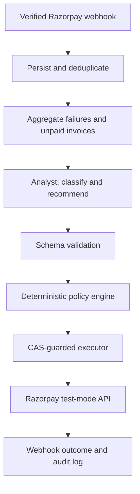

# Reclaim architecture

Reclaim starts when Razorpay's own subscription retries have exhausted and a subscription reaches `halted`.

`razorpay_state` is written from verified webhook events. `case_state` tracks this agent's pipeline independently. The LLM can propose a classification and action, but only the policy engine can approve an action and the executor rechecks state immediately before dispatch.
